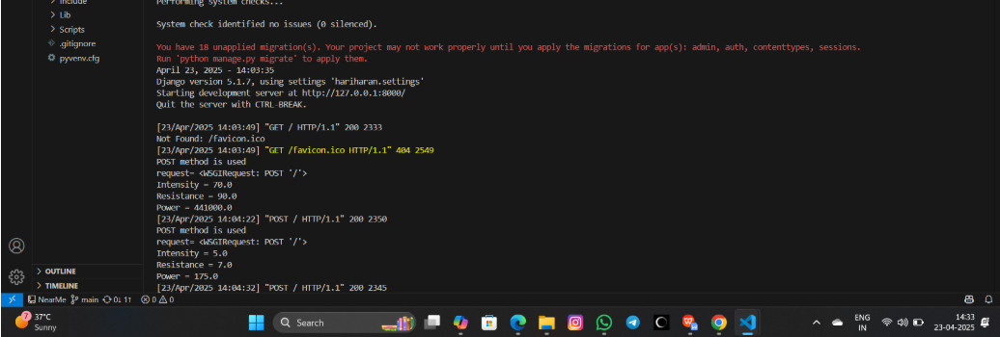
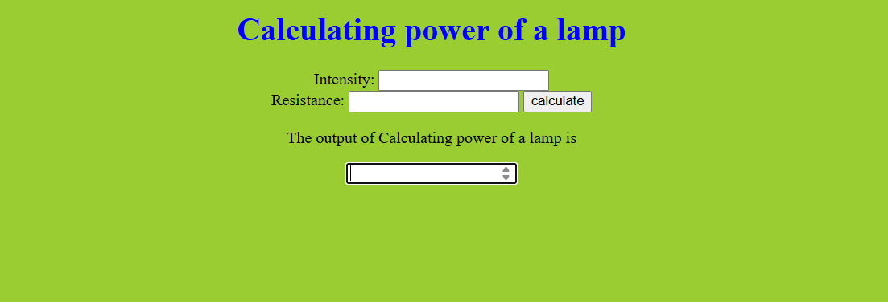

# Ex.05 Design a Website for Server Side Processing
## Date:

## AIM:
 To design a website to calculate the power of a lamp filament in an incandescent bulb in the server side. 


## FORMULA:
P = I<sup>2</sup>R
<br> P --> Power (in watts)
<br> I --> Intensity
<br> R --> Resistance

## DESIGN STEPS:

### Step 1:
Clone the repository from GitHub.

### Step 2:
Create Django Admin project.

### Step 3:
Create a New App under the Django Admin project.

### Step 4:
Create python programs for views and urls to perform server side processing.

### Step 5:
Create a HTML file to implement form based input and output.

### Step 6:
Publish the website in the given URL.

## PROGRAM :

```
index.html

<!DOCTYPE html>
<html lang="en">
<head>
    <meta charset="UTF-8">
    <meta name="viewport" content="width=device-width, initial-scale=1.0">
    <title>calculate</title>
    <style type="text/css">
        body{
        background-color:yellowgreen;
        }
        h1{
        color:blue;
        }
    </style>
</head>
<body>
    <center>
    <h1 align="center">Calculating power of a lamp</h1>
    <form action="" method="post">
        
        <label>Intensity:</label>
        <input type="number" name="intensity">
        <br>
        <label>Resistance:</label>
        <input type="number" name="resistance">
        <button type="submit">calculate</button>
    </form>
    <p>The output of Calculating power of a lamp is</p>
    <input type="number" name="home" value="{{output}}">
    </center>
</body>
</html>

views.py

from django.shortcuts import render
def home(request):
    if request.method == "POST":
        inte=int(request.POST.get('intensity'))
        res=int(request.POST.get('resistance'))
        power=(inte**2)*res
        return render(request,'index.html',{'output':power})
    return render(request,'index.html')

urls.py

from django.contrib import admin
from django.urls import path
from myapp import views
urlpatterns = [
path('admin/', admin.site.urls),
path('',views.home,name='home'),
]

```
## SERVER SIDE PROCESSING:


## HOMEPAGE:



## RESULT:
The program for performing server side processing is completed successfully.
